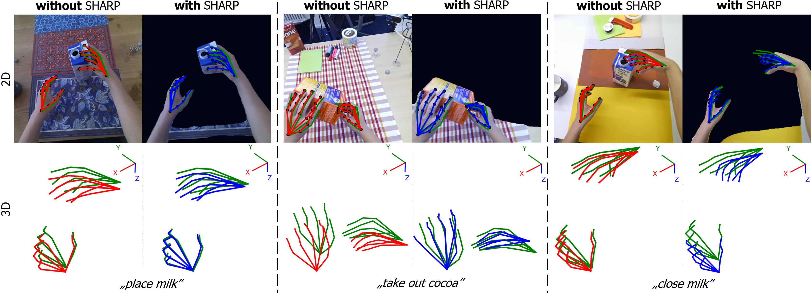

# SHARP: Segmentation of Hands and Arms by  Range using Pseudo-Depth for Enhanced Egocentric 3D Hand Pose Estimation and Action Recognition

<!--  -->

Implementation of the *SHARP* paper:

## Requirements

The file explorer is accessible using the button in left corner of the navigation bar. You can create a new file by clicking the **New file** button in the file explorer. You can also create folders by clicking the **New folder** button.

## Hand Pose Inference with *SHARP*

 - Download *H2O Dataset* from project page: https://taeinkwon.com/projects/h2o/
 - For using *SHARP* generate pseudo-depth images running script *generate_depth_h2o.py*
 - For not using *SHARP* *set use_depth: **False** in *config_h2o_3D_test.yaml*
 - For using SHARP with oracle ground truth data set use_depth: **True**  and *depth_img_type: **'gt'*** in *config_h2o_3D_test.yaml*
 - Setup config file for testing *config_h2o_3D_test.yaml* with a path to downloaded weights and path to dataset
 - Run command:
	 >python test_pose.py -c cfgs/config_h2o_3d_test.yaml

## Action Recognition Inference

You can rename the current file by clicking the file name in the navigation bar or by clicking the **Rename** button in the file explorer.

## Weights

### SHARP Hand Pose Model Weights:
>[SHARP 3D Hand Pose Estimation Model Weights](https://cloud.cvl.tuwien.ac.at/s/xQZs8JiaDnqcL5d)

>[SHARP 3D Hand Pose Estimation with Oracle Grund Truth Model Weights](https://cloud.cvl.tuwien.ac.at/s/WbE7eaf2fzfaSNe)

>[None-SHARP 3D Hand Pose Estimation Model Weights](https://cloud.cvl.tuwien.ac.at/s/dyzAY3swx3HjWBs)

### Action Recognition Model Weights:
>Link to weights

